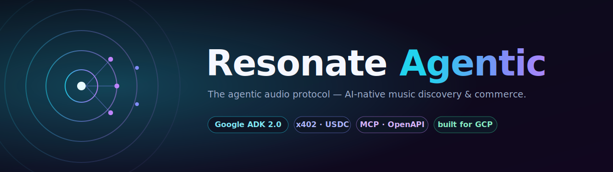
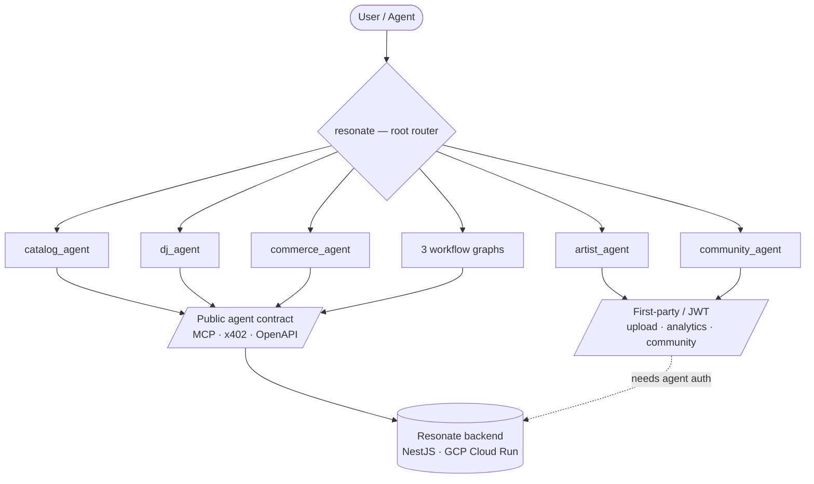

<div align="center">



# Resonate Agentic

**The agentic audio protocol — AI-native music discovery, commerce & creation, built on [Google ADK 2.0](https://google.github.io/adk-docs/).**

[](LICENSE)
[](pyproject.toml)
[](https://google.github.io/adk-docs/)
[](tests/)
[-4285F4.svg)](docs/GCP_AGENTIC_STACK.md)
[-7c3aed.svg)](#configuration)
[](STATUS.md)

</div>

> ⚗️ **Experimental.** A research-grade, agentic-first reimagining of [Resonate](https://github.com/akoita/resonate) — a machine-first audio-licensing platform — where **AI agents** discover stems, get USDC quotes, settle payments over **x402**, and prove usage rights. This repo is the **agentic layer**; the production backend lives upstream.

---

## What is this?

Resonate turns music stems into **programmable IP**: artists publish 6-way separated stems (vocals, drums, bass, guitar, piano, other), and *agents* — not just humans — can search, quote, purchase, and license them autonomously.

**Resonate Agentic** is the multi-agent brain that sits on top, written in Python on **Google ADK 2.0**:

- 🧭 a root **LLM router** that delegates to specialist agents,
- 🎚️ five **specialist agents** — catalog, DJ, commerce, artist, community,
- 🔀 three **workflow graphs** — discovery→purchase, artist upload, DJ session,
- 💳 native **x402 / USDC** commerce and **MCP + OpenAPI** integration,
- ☁️ **runtime- and model-portable** — priority target is **Agent Runtime** (Gemini Enterprise), but it runs on Cloud Run, GKE, or any host that runs Python; the LLM is swappable.

It is deliberately a *thin orchestration layer*: the heavy lifting (payments, on-chain rights, ML stem-separation, recommendation scoring) is **reused** from the production backend, never reimplemented — see [ADR-0001](docs/adr/ADR-0001-backend-reuse-vs-reimplement.md).

## ✨ Highlights

| | |
|---|---|
| **Agentic-native commerce** | Discover → quote → pay → download entirely agent-to-machine over **x402** (USDC on Base). |
| **Reuse, don't reimplement** | Consumes the backend's purpose-built agent contract — an **MCP server** (`catalog.search`, `stem.quote`, `stem.download`) + **OpenAPI** spec — verified live against staging. |
| **Compute-vs-data architecture** | Compute-bound features (the AI DJ, budget guardrails) run agent-side on public data; data-bound features reuse the backend ([ADR-0002](docs/adr/ADR-0002-feature-scope-compute-vs-data.md)). |
| **Graph workflows** | Deterministic ADK `Workflow` graphs with conditional routing, shared state, and agent-side budget enforcement. |
| **Portable by design** | No lock-in: built on open-source ADK, open standards (A2A/MCP), and a swappable model layer. **Gemini Enterprise is the priority target, not a requirement** — see [Portability](#-portability) and the [GCP guide](docs/GCP_AGENTIC_STACK.md). |

## 🏗️ Architecture



**Today, against the public contract (no auth):** catalog discovery, x402 commerce, and the AI DJ are functional. Upload / analytics / community are first-party-gated pending an agent auth path.

## 🔌 It talks to a real backend

The upstream backend ships an **explicit external-agent contract**, verified live on staging:

```bash
# point RESONATE_API_BASE at your Resonate backend, then:
curl "$RESONATE_API_BASE/.well-known/mcp.json"   # MCP: catalog.search, stem.quote, stem.download
curl "$RESONATE_API_BASE/openapi.json"           # OpenAPI 3.1 (public read paths)
curl "$RESONATE_API_BASE/.well-known/x402"       # x402 discovery (Base Sepolia · Circle USDC)
```

## 🌐 Portability

**Gemini Enterprise (Agent Runtime) is the priority deployment target — not a hard dependency.**
Nothing here locks you to GCP:

| Layer | Portable because… |
|-------|-------------------|
| **Framework** | [ADK](https://google.github.io/adk-docs/) is open-source (Apache-2.0) — plain Python you can run anywhere. |
| **Runtime** | Run on **Agent Runtime** (managed), **Cloud Run** / **GKE**, another cloud's container service, or locally (`adk run` / `adk web`). |
| **Models** | `AGENT_MODEL` is swappable — Gemini via AI Studio *or* Gemini Enterprise, or **any LLM** (OpenAI, Anthropic, local) through ADK's LiteLLM integration. |
| **Interop** | Speaks the open **MCP** and **A2A** standards, so it plugs into non-Google agentic ecosystems. |
| **Backend** | Consumed over an open contract (MCP · OpenAPI · x402), independent of where the agent runs. |

[docs/GCP_AGENTIC_STACK.md](docs/GCP_AGENTIC_STACK.md) is the deep-dive for the *priority* GCP target; the same agent deploys elsewhere with a different runtime + model config. See [ADR-0003](docs/adr/ADR-0003-runtime-and-model-portability.md).

## 🚀 Quickstart

Requires Python 3.11+.

```bash
git clone https://github.com/akoita/resonate-agentic.git
cd resonate-agentic

# install (Poetry, or plain venv)
poetry install --with dev
# — or —
python -m venv .venv && source .venv/bin/activate
pip install -r requirements.txt && pip install pytest pytest-asyncio respx ruff

cp .env.example .env   # add GOOGLE_API_KEY (or Vertex vars) + RESONATE_API_BASE
```

Run it:

```bash
adk web app     # browser playground
adk run app     # terminal chat
pytest -q       # tests (backend + LLM are mocked — no creds needed)
```

### Configuration

| Variable | Purpose |
|----------|---------|
| `RESONATE_API_BASE` | Resonate backend base URL (e.g. `http://localhost:3000`) |
| `RESONATE_API_KEY` | Backend bearer token (optional) |
| `GOOGLE_API_KEY` | Gemini via AI Studio (local dev) |
| `GOOGLE_GENAI_USE_VERTEXAI` · `GOOGLE_CLOUD_PROJECT` · `GOOGLE_CLOUD_LOCATION` | Gemini via the Gemini Enterprise Agent Platform (production) |
| `AGENT_MODEL` | Model id (default `gemini-2.5-flash`); any LLM via ADK's LiteLLM integration |

## 🧪 Testing

```bash
pytest -q        # 10 tests, fully offline
ruff check app tests
```

The suite proves the runtime contract without credentials: async tools run inside ADK's event loop, the `Workflow` engine routes branches and passes state, and the DJ's agent-side budget enforcement holds. The LLM-backed workflow nodes need live model creds for a full end-to-end run.

## 🗂️ Project layout

```
app/
  agent.py            root orchestrator (LLM router) + sub-agents
  config.py           env-driven config (AI Studio or Gemini Enterprise Agent Platform)
  schemas.py          Pydantic domain models
  agents/             catalog · dj · commerce · artist · community
  tools/              async backend tools (+ _http.py shared client)
  workflows/          discovery_purchase · artist_upload · dj_session
tests/                offline runtime + budget tests
docs/
  GCP_AGENTIC_STACK.md   GCP upskilling & target architecture
  adr/                   architecture decision records
```

## 🧭 Status & roadmap

This is an early prototype with an honest paper trail:

- **[STATUS.md](STATUS.md)** — production-readiness assessment & phased roadmap
- **[TECH_DEBT.md](TECH_DEBT.md)** — prioritized debt register
- **[docs/adr/](docs/adr/)** — architecture decisions (backend reuse, feature scope, **portability**)
- **[docs/GCP_AGENTIC_STACK.md](docs/GCP_AGENTIC_STACK.md)** — GCP agentic stack & Agent Runtime vs Cloud Run (priority target)

## 🙏 Acknowledgements

- [**Resonate**](https://github.com/akoita/resonate) — the production music & agent-commerce platform this layer orchestrates.
- [**Google Agent Development Kit (ADK)**](https://google.github.io/adk-docs/) — the agent framework.
- The [**x402**](https://www.x402.org/) payment protocol and Circle **USDC**.

## 📄 License

[Apache License 2.0](LICENSE) © 2026 Resonate / akoita.

---

<div align="center"><sub>Built with Google ADK 2.0 · portable across agentic runtimes · priority target: Gemini Enterprise Agent Runtime</sub></div>
